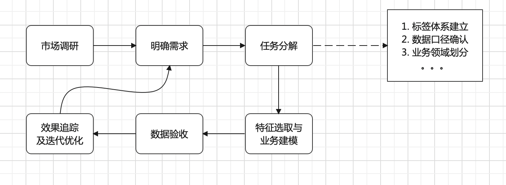

## 开发前准备
1. 数仓架构。需要有数仓负责人很熟悉数仓架构，不仅仅是表的结构设计、数据质量，还有调度、ETL、开发流程以及整个开发团队的技术储备。
2. 画像基础。需要了解、明确画像是什么，它能解决什么问题，这样才能定下大方向。只有明确了方向才能做好项目的排期和人员投入预算，也就间接决定了每个开发阶段的产出。
3. 标签体系。需要业务方来梳理需要的标签类型，大体分为用户属性、用户行为、用户风控等维度。
4. 存储方案。不同的标签有不同的使用方式，或者可以理解不同的业务方对标签的使用方式要求不同。存储到Hive、Kudu、MySQL等库里，也就意味着提供方式是表，适用房主要是针对分析人员。存储到Elasticsearch、HBase，是通过的产品化的方式展示。程序中调用，并且实时性要求高，那就要考虑MQ或者Kafka。实时性没有要求，可以提供接口或者SDK。
5. 画像产品。为了能让用户数据更好的服务于业务方，需要以产品化的形态应用在业务上。产品化的模块主要包括标签视图、用户标签查询、用户分群、透视分析等。
6. 画像应用。很多业务场景都可以应用到画像，比如短信召回，用户特征分析，客服针对大R用户的VIP服务。

## 开发流程
项目建设流程，大致如图：

#### 主要分为两部分
数据方面：标签开发【定量+定性】
产品方面：标签体系建立和画像的产品化

#### 定量标签
定量标签的产生完全依赖客观存储的数据，站在用户维度，根据业务的划分，将数仓中的指标重新定义到画像中。离线技术方案也简单，将平时的ETL工程进行模板化搬过来就好。针对实时方案，要考虑到使用方对实时性的要求程度以及资源投入产出比。

#### 定性标签
定性标签的产生基于定量，另外还要匹配自定义的逻辑。这个逻辑可能是一段复杂的SQL，可能是简单的比较大小，也可能是加减乘除。要根据业务特点来具体情况具体分析。

#### 重点考虑
1. 虽然每个公司业务特点不同，但是画像都有一个共性，有时效性。
2. 定量标签的过期会影响到定性标签的生成。
3. 在离线和实时工程共同计算并且不断产出的情况下，如何保证数据一致性。
4. 标签的存储大体分为两种，宽表和窄表。窄表扩展容易，宽表计算方便。
5. 如何监测每一步计算的进度。虽然只是监控，重要性也非常高。